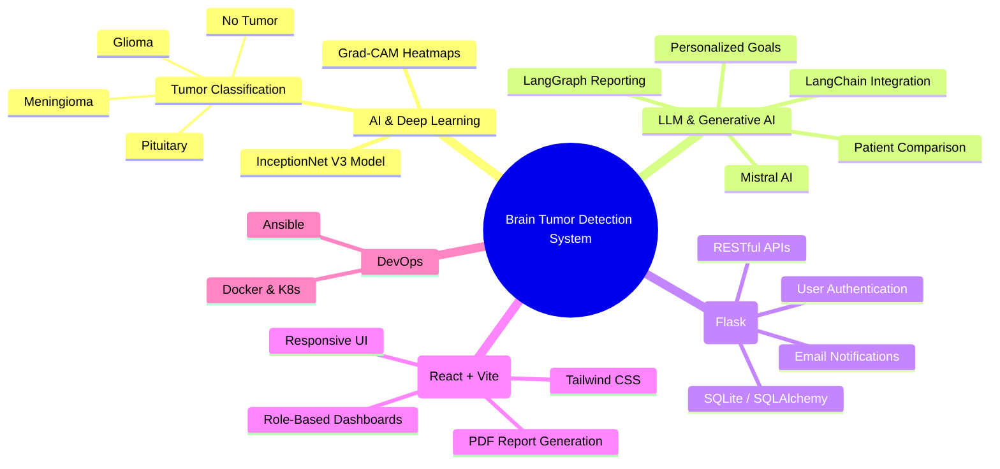
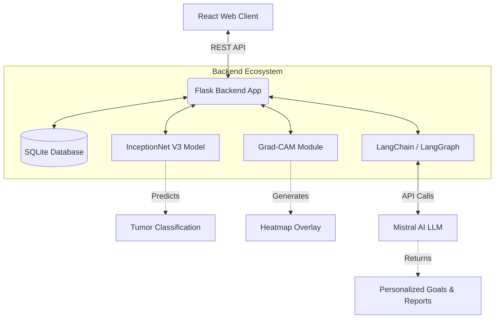
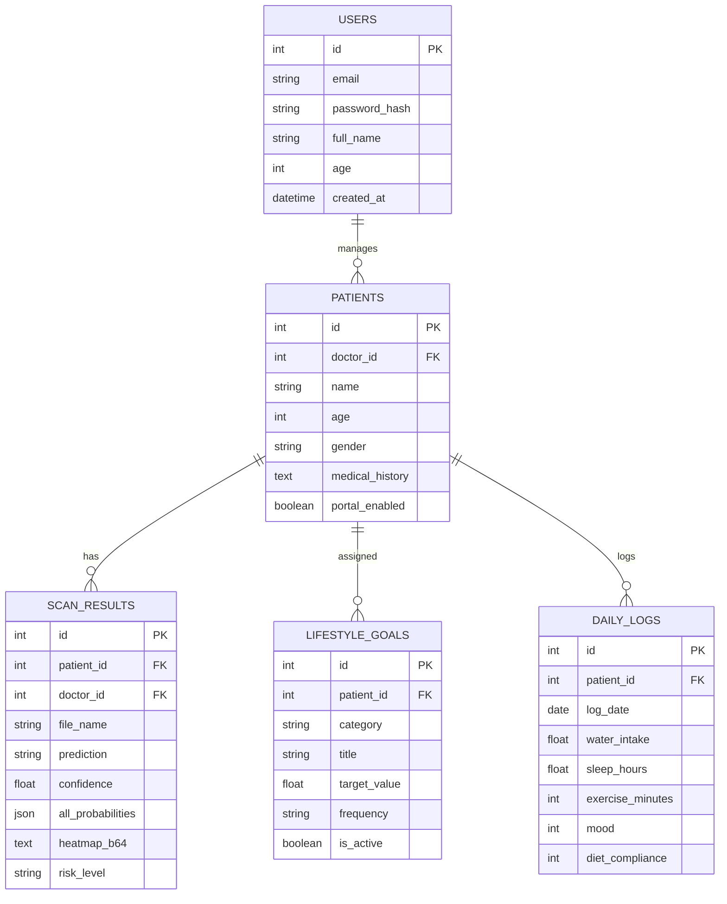

# 🧠 Brain Tumor Detection System - Comprehensive Analysis

## 🌟 1. Project Overview
The **Brain Tumor Detection System** is an advanced AI-powered medical application built to assist doctors, practitioners, and patients in identifying brain tumors from MRI scans. The system not only classifies tumors into multiple categories but also serves as a complete Patient Management and Lifestyle Coaching portal using cutting-edge Generative AI (LLMs).

### 🎯 Key Capabilities
*   **Deep Learning MRI Classification:** Utilizes a fine-tuned InceptionNet V3 model.
*   **Explainable AI (XAI):** Uses Grad-CAM to generate heatmaps highlighting the exact region of interest in the MRI scan.
*   **AI-Driven Lifestyle Coaching:** Generates personalized daily goals and lifestyle recommendations for patients using LangChain and Mistral LLMs.
*   **Patient & Doctor Portals:** Role-based access control allowing doctors to manage patients and patients to log daily lifestyle metrics.

---

## 🏗️ 2. Mind Map: Core Features



---

## 🛠️ 3. Technology Stack (Factual Information)
*   **Backend Framework:** Python Flask
*   **Machine Learning Model:** TensorFlow, Keras (InceptionNet V3)
*   **Explainable AI:** Grad-CAM (OpenCV, NumPy)
*   **Generative AI:** LangChain, LangGraph, Mistral AI (`mistral-small-latest`)
*   **Database:** SQLite via SQLAlchemy ORM
*   **Authentication:** Flask-Login, Flask-Bcrypt
*   **Frontend:** React 19, Vite, Tailwind CSS, Lucide React
*   **Deployment:** Docker, Kubernetes (`k8s`), Ansible

### 📈 Model Performance
*   **Test Accuracy:** 90%
*   **Optimization Techniques:** Keras Tuner, Data Augmentation

---

## 📐 4. System Architecture & Design

The application follows a client-server architecture where a modern React frontend communicates via REST APIs to a Flask backend, which integrates both predictive ML models and generative AI APIs.



---

## 🗄️ 5. Database Schema

The database utilizes relational models to track doctors (Users), Patients, MRI Scans, Lifestyle Goals, and Daily Logs.



---

## ⚙️ 6. Detailed Working Mechanism

### 6.1 MRI Scan Processing & Prediction Flow
1. **Upload:** Doctor/Patient uploads an MRI scan image (`.jpg`, `.png`) via the React frontend.
2. **Preprocessing:** The Flask backend receives the image, resizes it to the expected dimensions of the InceptionNet V3 model, and normalizes pixel values.
3. **Inference:** The `Brain_tumor_inception_model.h5` model processes the image and outputs probabilities for the four classes: `Glioma`, `Meningioma`, `Pituitary Tumor`, and `No Tumor`.
4. **Explainability:** The `gradcam.py` script computes the gradient of the predicted class with respect to the final convolutional layer to generate a heatmap (Grad-CAM), visually highlighting the tumor's location.
5. **Storage & Response:** The prediction, confidence score, and base64-encoded heatmap are stored in the `ScanResult` table and returned to the frontend for display.

### 6.2 AI Lifestyle Generation Flow
1. **Trigger:** After a diagnosis is generated, the doctor requests personalized lifestyle goals.
2. **LLM Prompting:** `ai_chains.py` constructs a prompt including the patient's age, gender, diagnosis, and medical history.
3. **Mistral AI via LangChain:** LangChain passes this context to Mistral AI, enforcing a strict JSON output parser to guarantee structured goals (e.g., Hydration, Sleep, Exercise).
4. **Assignment & Tracking:** Goals are persisted in the `LifestyleGoal` table and made visible in the patient's portal. Patients log daily metrics (water intake, sleep, mood) in the `DailyLog` table.
5. **AI Feedback:** LangGraph multi-agent systems are used to analyze daily logs and generate progress reports/tracker feedback.

---

## 📝 7. Examples

### Example 1: Model Prediction Output
**Input:** Patient MRI Scan Image 
**Output Processing:**
*   **Prediction:** `Meningioma`
*   **Confidence:** `94.2%`
*   **Risk Level:** `Moderate`
*   **Visual:** A heatmap overlaying the exact location of the tumor on the MRI, helping doctors visually verify the AI's decision.

### Example 2: LLM Generated Lifestyle Goal
**Input Context:** Patient is a 45-year-old male with a recent diagnosis of Glioma.
**Mistral LLM Output (Parsed JSON):**
```json
{
  "category": "hydration",
  "title": "Maintain optimal hydration",
  "description": "Drink sufficient water to help flush out toxins and reduce fatigue.",
  "target_value": 8,
  "unit": "glasses",
  "frequency": "daily"
}
```
